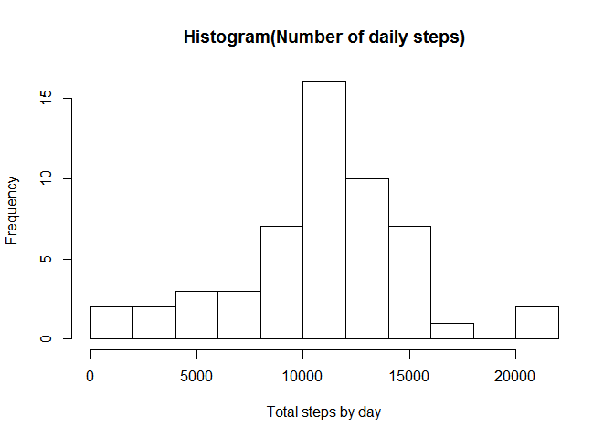
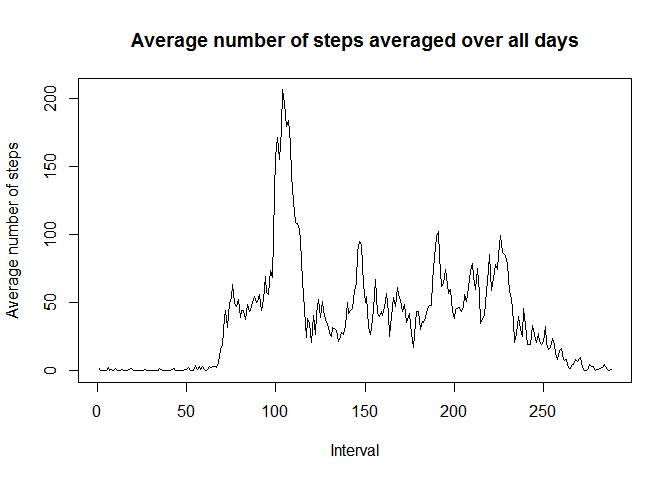
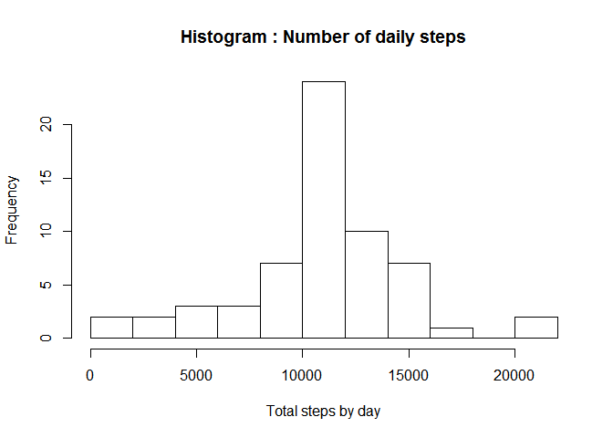
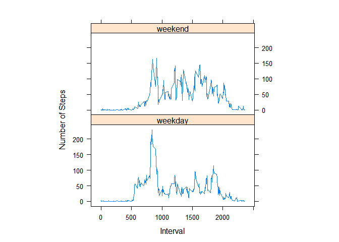

# Reproducible Research: Peer Assessment 1

##Introduction

It is now possible to collect a large amount of data about personal movement using activity monitoring devices such as a **Fitbit**, **Nike Fuelband**, or **Jawbone Up**. These type of devices are part of the "quantified self" movement - a group of enthusiasts who take measurements about themselves regularly to improve their health, to find patterns in their behavior, or because they are tech geeks. But these data remain under-utilized both because the raw data are hard to obtain and there is a lack of statistical methods and software for processing and interpreting the data.

This assignment makes use of data from a personal activity monitoring device. This device collects data at 5 minute intervals through out the day. The data consists of two months of data from an anonymous individual collected during the months of October and November, 2012 and include the number of steps taken in 5 minute intervals each day.

The data for this assignment can be downloaded from the course web site:

    Dataset: Activity monitoring data [52K]

The variables included in this dataset are:

    steps: Number of steps taking in a 5-minute interval (missing values are coded as NA)
    date: The date on which the measurement was taken in YYYY-MM-DD format
    interval: Identifier for the 5-minute interval in which measurement was taken

The dataset is stored in a comma-separated-value (CSV) file and there are a total of 17,568 observations in this dataset.

## Loading and preprocessing the data
  1. Clone from https://github.com/rdpeng/RepData_PeerAssessment1.git
  
  2. Push to my github https://github.com/ericsyang/courseraReproducibleResearch/tree/master/RepData_PeerAssessment1
  
  3. The *activity.zip* is available for this project.


```r
unzip("activity.zip")
dataset <- read.csv("activity.csv")
#overview the activity data
str(dataset)
```

```
## 'data.frame':	17568 obs. of  3 variables:
##  $ steps   : int  NA NA NA NA NA NA NA NA NA NA ...
##  $ date    : Factor w/ 61 levels "2012-10-01","2012-10-02",..: 1 1 1 1 1 1 1 1 1 1 ...
##  $ interval: int  0 5 10 15 20 25 30 35 40 45 ...
```

```r
head(dataset)
```

```
##   steps       date interval
## 1    NA 2012-10-01        0
## 2    NA 2012-10-01        5
## 3    NA 2012-10-01       10
## 4    NA 2012-10-01       15
## 5    NA 2012-10-01       20
## 6    NA 2012-10-01       25
```

## What is mean total number of steps taken per day?
### 1. Process/transform the data, and make a histogram of the total number of steps taken each day


```r
# convert date to date format
dataset$date <- as.Date(dataset$date, "%Y-%m-%d")
class(dataset$date)
```

```
## [1] "Date"
```

```r
dateGroup <- factor(dataset$date)

#total steps by day
sumOfSteps <- tapply(dataset$steps, dateGroup, sum)

hist(sumOfSteps, xlab="Total steps by day", ylab = "Frequency", main = "Histogram(Number of daily steps)", breaks = 10)
```



### 2. Mean of total number of steps taken per day

```r
meanOfSteps <- mean(sumOfSteps, na.rm = TRUE)
meanOfSteps
```

```
## [1] 10766.19
```

### 3. Median of total number of steps taken per day

```r
medianOfSteps <- median(sumOfSteps, na.rm = TRUE)
medianOfSteps
```

```
## [1] 10765
```

## What is the average daily activity pattern?

### 1. Make a time series plot (i.e. type = "l") of the 5-minute interval (x-axis) and the average number of steps taken, averaged across all days (y-axis)

```r
intervalGroup <- factor(dataset$interval)

meanOfStepsByInterval <- tapply(dataset$steps, intervalGroup, mean, na.rm = TRUE)

plot(meanOfStepsByInterval, type = "l", main="Average number of steps averaged over all days", xlab="Interval", ylab="Average number of steps")
```


### 2. Which 5-minute interval, on average across all the days in the dataset, contains the maximum number of steps

```r
maxSteps <- dataset$interval[which.max(meanOfStepsByInterval)]

maxSteps
```

```
## [1] 835
```

The Maximum number of steps: 835

## Imputing missing values

### 1. Calculate and report the total number of missing values in the dataset (i.e. the total number of rows with NAs)

There are 

```r
sum(is.na(dataset$steps))
```

```
## [1] 2304
```
Values.

### 2. Devise a strategy for filling in all of the missing values in the dataset. The strategy does not need to be sophisticated. Use the mean for that 5-minute interval.
### 3. Create a new dataset - *newDataset* that is equal to the original dataset but with the missing data filled in.


```r
newDataset <- dataset
# calculate total data filled in
count = 0

stepsInterval <- aggregate(steps~interval,data=dataset,mean,na.rm=TRUE)

intervalToSteps <- function(x){
  stepsInterval[stepsInterval$interval == x,]$steps
} 

for(i in 1:nrow(newDataset)){
  if(is.na(newDataset[i,]$steps)){
    newDataset[i,]$steps <- intervalToSteps(newDataset[i,]$interval)
    count = count + 1
  }
}

cat("Total", count, "NA are filled in.")
```

```
## Total 2304 NA are filled in.
```

There are total 2304 NA that are filled in.  

### 4.Make a histogram of the total number of steps taken each day and Calculate and report the mean and median total number of steps taken per day. 
  - Do these values differ from the estimates from the first part of the assignment?   
  - What is the impact of imputing missing data on the estimates of the total daily number of steps?


```r
#Plot histgram
sumOfSteps2 <- tapply(newDataset$steps, dateGroup, sum)
hist(sumOfSteps2, xlab = "Total steps by day", ylab = "Frequency", 
    main = "Histogram : Number of daily steps", breaks = 10)
```



```r
#Mean and Median total number of steps taken per day

meanOfSteps2 <- mean(sumOfSteps2, na.rm = TRUE)
meanOfSteps2
```

```
## [1] 10766.19
```

```r
medianOfSteps2 <- median(sumOfSteps2, na.rm = TRUE)
medianOfSteps2
```

```
## [1] 10766.19
```

We can see from above values. The mean value is the same as the value before imputing missing data because we put the mean value for that particular 5-min interval in the NAs. The median value shows a little bit difference, but it depends on where the missing values are.


## Are there differences in activity patterns between weekdays and weekends?

### 1. Create a new factor variable in the dataset with two levels -- "weekday" and "weekend" indicating whether a given date is a weekday or weekend day.


```r
newDataset$day <- weekdays(newDataset$date)
newDataset$day[newDataset$day == "Saturday" | newDataset$day == "Sunday"] <- "weekend"
newDataset$day[newDataset$day == "Monday" | newDataset$day == "Tuesday" | newDataset$day == 
    "Wednesday" | newDataset$day == "Thursday" | newDataset$day == "Friday"] <- "weekday"
```

### 2. Make a panel plot containing a time series plot (i.e. type = "l") of the 5-minute interval (x-axis) and the average number of steps taken, averaged across all weekday days or weekend days (y-axis). 


```r
stepsInterval2 = aggregate(steps~interval + day, newDataset, mean)

library(lattice)

xyplot(steps~interval|factor(day),data=stepsInterval2,aspect=1/2,type="l", xlab="Interval", ylab = "Number of Steps")
```


